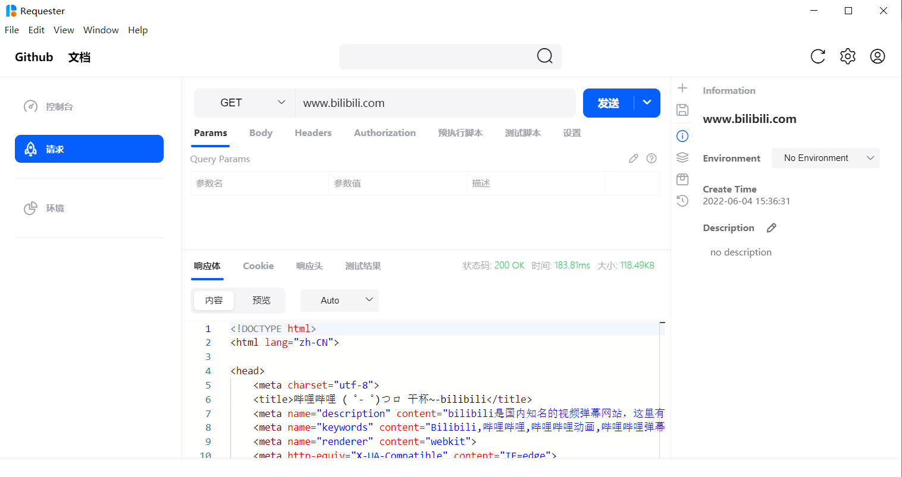
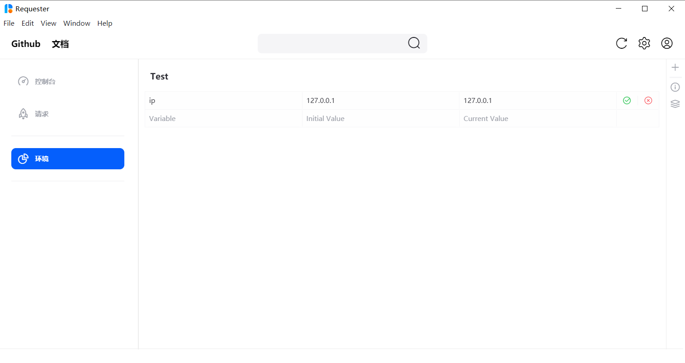

# Requester

Requester是一个基于Electron类似Postman的工具，是我毕设的一个项目，断断续续做了大半年，自己封装了HTTP请求的模块，基本实现了HTTP/HTTPS请求的功能，Params、Body、Headers、Authorization、PreTest、Test、CookieJar等功能。目前界面还是不太完善，还在勉强能用的阶段。

## 预览



## 

## 运行

目前软件仅支持在Windows端运行

```bash
npm install 
# 运行开发版
npm run dev

# 打包
npm run build
```

`npm install`时发生错误可以尝试使用`npm install --force`

运行时发生错误可以运行`.\install.ps1`安装对应版本的electron。

## 食用手册

与Postman基本一致，日后再写


## TODO
> TODO List

